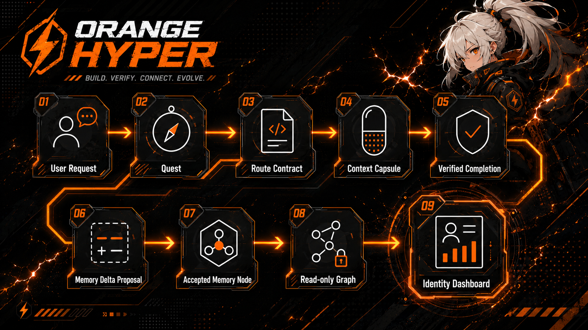
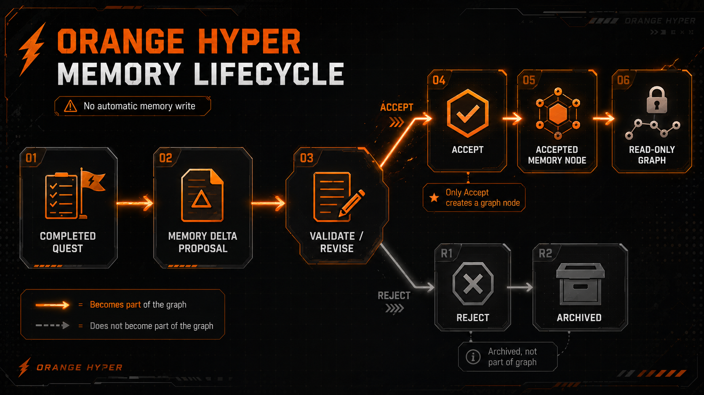

<p align="center">
  
</p>

<h2 align="center">
  不把项目当作控制对象，<br />
  而是陪在身边照料，让它一起成长。
</h2>

[](README.md) [](README.en.md) [](README.zh-CN.md) [](README.ja.md)

<details>
<summary>版本元数据详情</summary>

- Base README: [README.md](README.md)
- README version: `0.8-doc.0`
- Package version: see [package.json](package.json)
- Adapter JSON contract: `0.1`
- Base language: `ko`
- Translation source of truth: `README.md` (`ko`)

如果本译文落后，请以韩文 README 为准。README version、package version 和 Adapter JSON contract version 是彼此独立的版本轴。

</details>

[](https://www.npmjs.com/package/orange-hyper) [](https://github.com/KoreanCode/orange-hyper/actions/workflows/ci.yml) [](LICENSE) [](package.json)

## 问题 · 思考 · 方向

| 问题 | 思考 | 方向 |
| --- | --- | --- |
| 强 harness 会把过重流程压到小任务上。 | 无 harness 很轻，但 memory、验证和 boundary 都偏弱。 | Orange Hyper 只让必要的记忆通过 proposal -> review -> accept 成长。 |

## 问题定义

强 SDD harness 对大型任务有帮助。但如果小任务也必须走 branch、spec、review、verification、PR loop，很快就会产生疲劳。

无 harness 的流程很轻。它也很难长期维持 memory、验证、重复学习和 context boundary。

顺序式 SPEC 不适合协作和非线性思考。决策、约束、验证和风险不是排成一条直线，而是互相连接。

用户想轻松对话。项目却不能失去记忆和验证。

## 对 Harness 的思考

harness 可以建立流程，流程可以带来安全感。但如果所有任务都套同一种流程，用户就会为了运转 harness 而工作。

Orange Hyper 不会一开始就打开强 harness。它也不会像无 harness 流程那样把一切都交给模型指令。

需要的是两者之间的地带。小请求应该小结束。更大的工作应该留下意图、约束、memory 和验证证据。

## 选择的方向

- Intent 应该被编译。
- 工作应该按 level 和 layer 划分。
- Verification 应该随工作 level 变强。
- Memory 应该像 node graph 一样成长，而不是顺序 SPEC 链。
- role、MCP、hook、subagent 不会从一开始启用。
- role、MCP、hook、subagent 只从重复证据中成长。
- 轻量开始，逐步成长。
- 不做 automatic memory write。
- 只从 completed Quest 创建 Memory Delta Proposal。
- 只有用户 accept 的 proposal 才会成为 graph node candidate。
- 只有匹配当前 `project_id` 的 memory 才是当前项目 memory。
- CLI 是 skill、agent、adapter 调用的 kernel interface，不是最终用户 UX。

## Core Flow

<p align="center">
  
</p>

用户请求会成为 Quest，再经过 Route Contract 和 Capsule，走向经过验证的完成状态。只有 completed Quest 才能成为 Memory Delta Proposal 的起点。

## Orange Hyper 是什么？

Orange Hyper 是面向 coding agent 的 repo-local project-memory kernel。

用户请求会被整理成 Quest 和 Route Contract。结果和验证证据会记录在 completed Quest 中。需要时，completed Quest 可以生成 Memory Delta Proposal，只有用户批准的 proposal 才会成为 project memory candidate。

目标不是巨大的自动化系统。用户继续轻松提出请求。项目只记住需要记住的内容，并按工作需要的 level 增强验证。

## 当前功能

以 v0.7.0 为基准，Orange Hyper 提供 Seed Kernel、Memory Graph Usability、read-only Identity Graph Preview、Minimal Hook Preview、MCP Advisor stable、Growth Signal Preview stable 和 Adapter Invocation Contract stable 功能。

- `orange init` 创建 repo-local `.orange-hyper/` 结构。
- Quest markdown 和 YAML frontmatter 记录工作意图。
- Route Contract 记录 work level、procedure、tool、verification budget。
- Context Capsule 汇总当前任务需要的上下文。
- `quest done` 要求 verification evidence 或 unverified reason。
- completed Quest 可以创建 Memory Delta Proposal。
- pending proposal 可以 list、show、validate、revise、accept、reject。
- accepted proposal 会成为带 provenance 的 graph node candidate。
- `graph list`、`graph show`、`graph search`、`graph rebuild-index` 可以 read-only 浏览当前项目的 accepted memory node。
- `graph list --type ... --source-quest ... --source-proposal ...` 和 `graph search <query> --type ... --source-quest ...` 可以将结果限制在当前项目的 accepted node 内。
- Project Boundary 不把不同 `project_id` 的 memory 当作当前项目 memory。
- `doctor` 检查 Quest、proposal、accepted node 和 Project Boundary 状态。
- `identity build` 会创建汇总 Seed Kernel 状态和 read-only Identity Graph Preview 的 Identity Dashboard 文件。
- `hook preview`、`hook status`、`hook run session-start`、`hook run stop` 提供 read-only / warning-first hook preview。
- hook preview 不会自动修改 Quest、Proposal、Graph、Identity 或 Project Boundary。
- 只有显式传入 `--write-report` 时，才会在 `.orange-hyper/hooks/reports/` 下生成 local report。
- hook warning 和 local report 会保持 adapter 可解析的稳定 JSON shape。
- `mcp list`、`mcp show`、`mcp suggest` 只提供带 score、confidence、matched_signals 和 no-suggestion 状态的 read-only MCP proposal card。
- MCP Advisor proposal card 不是安装或执行结果，并保持 `requires_user_approval: true`、`not_executed: true`、`config_mutation: false` 边界。
- MCP Advisor 不会安装或运行 MCP，不会修改 config，不会写入 project memory，也不会发起外部网络调用。
- `growth status`、`growth suggest`、`growth explain` 会读取 Quest、Route、accepted Memory Graph、Hook warning 和 MCP advisor signal，预览更保守的成长状态，以及带 score/source evidence 的候选项。
- Growth candidate 只是建议，并保持 `auto_unlock: false` 和 `requires_user_approval: true`。
- Growth Signal Preview 的 `growthLevel` 只是装饰性候选，不会自动 unlock role、tool、hook、MCP、subagent 或 workflow。
- `adapter list`、`adapter show <recipe-id>`、`adapter dry-run <recipe-id>` 描述 natural-language/skill layer 如何通过 `--json` recipe 调用 Orange Kernel。
- adapter dry-run 通过 `missing_inputs`、`input_source`、`step_index`、`next_user_decision` 描述安全调用顺序。
- Adapter Layer 不直接修改 `.orange-hyper`，不解析 human output，也不会自动运行 Quest、Memory、MCP、Hook 或 Subagent 流程。
- Adapter JSON Contract 定义 `--json` envelope、command id、stdout/stderr 和 exit-code 规则。

## Memory Lifecycle

<p align="center">
  
</p>

Orange Hyper 不会自动保存记忆。只有用户 accept 的 proposal 才会成为 accepted memory node candidate，pending 或 rejected proposal 不是 graph node。

## Type Safety Foundation（类型安全基础）

在 v0.3 stable 中，Type Safety Foundation 并不是把 Orange Hyper 一次性改写成 TypeScript。它的意思是，项目先为自己承诺的数据形状加上一层检查：`--json` 输出，以及 Quest、Proposal、Graph、Doctor、Identity 之间传递的信息。

- Orange Hyper 在这个阶段仍然以 JavaScript 包发布。
- TypeScript 先作为安静的检查工具使用，帮助确认这些数据形状没有被不小心改坏。
- 完整的 TypeScript 源码迁移在 v0.4 stable 之后仍作为单独的后续工作保留。
- Adapter JSON Contract 继续保持 `contract_version: "0.1"`。

## 安装与使用

Node 20 或更高版本可以直接用 `npx` 运行。npm package name 是 `orange-hyper`，primary CLI command 是 `orange`。

推荐用法：

```bash
npx -y --package orange-hyper@latest orange init
npx -y --package orange-hyper@latest orange quest new "README npm usage polish" --layer L2 --json
```

Stable latest channel:

```bash
npx -y --package orange-hyper@latest orange init
```

Source checkout:

```bash
node bin/orange.js init
```

Local linked development:

```bash
npm link
orange init
```

常用命令：

```bash
npx -y --package orange-hyper@latest orange quest list
npx -y --package orange-hyper@latest orange route "查找搜索排序 bug 的原因"
npx -y --package orange-hyper@latest orange capsule
npx -y --package orange-hyper@latest orange quest done <quest-id> --evidence "npm test passed"
npx -y --package orange-hyper@latest orange doctor
npx -y --package orange-hyper@latest orange mcp suggest --query "Need latest React API documentation before migration" --json
npx -y --package orange-hyper@latest orange growth status --json
npx -y --package orange-hyper@latest orange growth suggest --json
npx -y --package orange-hyper@latest orange adapter dry-run project-status --json
```

从 v0.2.0 项目升级到 v0.2.1 Project Boundary Guard 时，先运行：

```bash
orange doctor --json
orange doctor --repair-project-id
orange doctor
```

`--repair-project-id` 只填补缺失的 legacy project identity。它不会覆盖已经属于其他项目的文件。

## Roadmap

详情见 [Development Roadmap](docs/10_DEVELOPMENT_ROADMAP.md)。

- v0.1 Seed Kernel
- v0.2 Memory Delta Proposal
- v0.3 Memory Graph Usability + Identity Graph Preview
- v0.4 Minimal Hook Preview (stable)
- v0.5 MCP Advisor (stable)
- v0.6 Growth Signal Preview (stable)
- v0.7 Adapter Invocation Contract (stable)
- v0.8 Eval and Reports
- v1.0 Stable product boundary

## Non-goals

Orange Hyper 不打算成为：

- 某个模型或 provider 的 clone
- 对所有任务强制 SPEC 的 SDD framework
- 对所有任务强制 branch、PR、review loop 的 workflow manager
- automatic memory write
- 未经用户批准的 memory accept
- raw prompt archive
- 从第一天就启用的 role zoo、MCP bundle、hook system 或 subagent orchestration
- MCP 自动安装、自动执行或 config 自动修改
- auto planner 或 auto execution loop
- 必须依赖 graph DB 或 vector DB 的系统
- 自动把外部 report、clipboard、file 当作 project memory 的系统

## Docs Links

- [Project Definition](docs/00_PROJECT_DEFINITION.md)
- [Architecture](docs/01_ARCHITECTURE.md)
- [Memory Graph Spec](docs/02_MEMORY_GRAPH_SPEC.md)
- [Route Level System](docs/04_ROUTE_LEVEL_SYSTEM.md)
- [Development Roadmap](docs/10_DEVELOPMENT_ROADMAP.md)
- [Identity Dashboard Spec](docs/14_IDENTITY_DASHBOARD_SPEC.md)
- [Adapter JSON Contract](docs/16_ADAPTER_CONTRACT.md)
- [Minimal Hook Preview](docs/17_MINIMAL_HOOK_PREVIEW.md)
- [MCP Advisor](docs/18_MCP_ADVISOR.md)
- [Growth Signal Preview](docs/19_GROWTH_SYSTEM.md)
- [Adapter Layer](docs/20_ADAPTER_LAYER.md)
- [Release Notes](RELEASE_NOTES.md)
