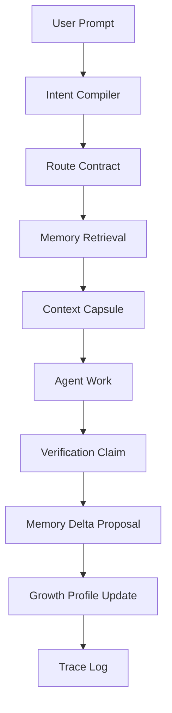

# Orange Hyper 아키텍처

## 1. 전체 구조

`orange-hyper`는 네 계층으로 나눈다.

```text
User Interface Layer
- CLI
- prompt templates
- optional Codex/Claude adapters

Harness Core
- intent compiler
- route contract engine
- memory graph engine
- context capsule builder
- verification policy
- growth system

Runtime Adapter Layer
- Codex adapter
- Claude Code adapter
- generic CLI adapter
- future IDE adapter

Storage Layer
- .orange-hyper/graph nodes
- edges.jsonl
- index.json
- traces
- proposals
- local private memory
```

핵심 원칙은 core가 특정 모델이나 특정 agent client에 종속되지 않는 것이다. Codex hooks, Codex skills, MCP configuration, subagent TOML은 adapter에만 둔다.

## 2. 기본 실행 흐름

```text
1. User Prompt
2. Intent Compile
3. Route Contract 결정
4. Memory Graph에서 필요한 node slice 검색
5. Context Capsule 생성
6. Agent 작업 수행
7. Verification Claim 작성
8. Memory Delta 제안
9. Growth Profile 갱신 후보 생성
10. Trace 기록
```

Mermaid 표현:



## 3. 주요 컴포넌트

### 3.1 Intent Compiler

사용자의 자연어 요청을 작업 가능한 구조로 바꾼다.

출력물은 `Intent Capsule`이다.

```yaml
intent_id: intent_20260616_001
raw_request: "탈퇴한 이메일도 다시 가입 가능하게 바꿔줘"
primary_outcome: "회원가입 정책 변경"
output_contract: "code_change"
scope_hint: "auth/signup"
constraints:
  - "기존 OAuth 가입 흐름 영향 확인"
unknowns:
  - "탈퇴 사용자 상태를 어떤 컬럼으로 판단하는지 확인 필요"
risk_level: "medium"
```

### 3.2 Route Contract Engine

작업의 크기와 성격에 따라 level, memory budget, tool budget, verification level, delegation level을 결정한다.

```yaml
route: L2/P2/T2/V2/A0/M0
layer: L2
procedure_budget: P2
tool_budget: T2
verification_level: V2
delegation: A0
mcp: M0
memory_budget:
  max_nodes: 5
  max_tokens: 1500
```

### 3.3 Memory Graph Engine

프로젝트 지식을 node와 edge로 관리한다. sequential SPEC이 아니라 의미 관계 중심이다.

```text
Decision Node --touches--> Component Node
Constraint Node --applies_to--> Component Node
Risk Node --verified_by--> Verification Node
Tool Node --useful_for--> Intent Pattern Node
```

### 3.4 Context Capsule Builder

현재 작업에 필요한 memory node만 모아 작은 context 문서를 만든다. 전체 wiki를 읽지 않는다.

```md
# Context Capsule

Task:
Relevant decisions:
Relevant constraints:
Touched components:
Known risks:
Verification commands:
Excluded memory:
```

### 3.5 Verification Policy

작업 level에 따라 필요한 검증 기준을 정한다. source-only completion claim을 막는다.

### 3.6 Growth System

반복되는 evidence를 기반으로 role, tool, MCP, verification routine을 unlock한다. 성장 규칙은 자동 적용이 아니라 proposal-first다.

## 4. `.orange-hyper/` 디렉터리 설계

```text
.orange-hyper/
  config.json
  quests/
    active/
    completed/
  graph/
    nodes/
      decision/
      constraint/
      component/
      risk/
      verification/
    edges.jsonl
    index.json
  capsules/
    current.md
  traces/
    route.jsonl
  proposals/
    memory-delta/
      pending/
      accepted/
      rejected/
  local/
```

`local/`은 기본적으로 `.gitignore` 대상이다. v0.2에서 `graph/`는 accepted proposal이 만드는 node 후보 저장소이며, active retrieval이나 graph rendering은 아직 하지 않는다.

## 5. 상태 변경 원칙

`orange-hyper`는 자동으로 프로젝트 기억을 확정하지 않는다. 모든 memory write는 기본적으로 proposal 상태를 거친다.

```text
observed → proposed → accepted/rejected → indexed → retrieved
```

자동 기록은 trace까지만 허용한다. 장기 기억으로 승격하려면 사용자 승인 또는 명시적 정책이 필요하다.

## 6. MVP 구현 범위

v0.2에서 필요한 최소 컴포넌트:

```text
orange init
orange quest new <request>
orange route --quest <quest-id>
orange capsule --quest <quest-id>
orange quest done <quest-id>
orange remember propose --quest <quest-id>
orange remember list/show/accept/reject
orange doctor
orange identity build
```

v0.2에서 하지 않을 것:

- hook 자동 설치
- MCP 자동 설치
- subagent 자동 생성
- role 자동 생성
- branch/PR workflow 생성
- LLM API 호출 필수화
- Memory Graph rendering
- 자동 memory write

## 7. 기술 스택 제안

오픈소스 CLI 배포를 생각하면 TypeScript가 유리하다.

추천:

```text
Language: TypeScript
Runtime: Node.js 20+
CLI: commander 또는 cac
Schema: zod
Storage: markdown + jsonl + yaml
Test: vitest
Package: npm
```

개인 실험 속도가 우선이면 Python도 가능하다. 다만 MCP/CLI 생태계, `npx orange-hyper init` 같은 배포 UX를 고려하면 TypeScript를 1순위로 본다.

## 8. 핵심 설계 리스크

### 8.1 Memory bloat

node가 많아지는 것은 문제가 아니다. 매 작업에 너무 많은 node를 읽는 것이 문제다. retrieval budget을 반드시 둔다.

### 8.2 Role zoo

backend, frontend, mobile, devops, security role을 처음부터 만들면 실패한다. role은 반복 증거에서 생성되어야 한다.

### 8.3 Hook overreach

hook은 validation과 capsule 주입의 안전장치여야 한다. workflow 강제 장치가 되면 다시 피로한 하네스가 된다.

### 8.4 MCP sprawl

MCP는 기본값이 아니라 proposal이어야 한다. 매 프로젝트에 모든 tool을 연결하지 않는다.

## 9. 아키텍처 한 줄 요약

`orange-hyper`는 user prompt를 Intent Capsule로 컴파일하고, project memory graph에서 최소 node slice를 뽑아 Context Capsule을 만들며, 작업 level에 맞는 검증과 성장 제안을 기록하는 adaptive harness이다.
